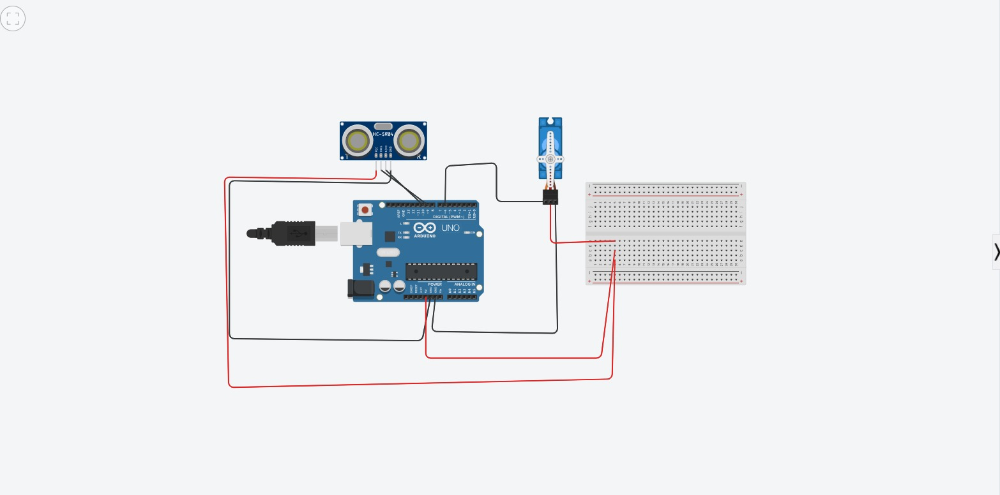
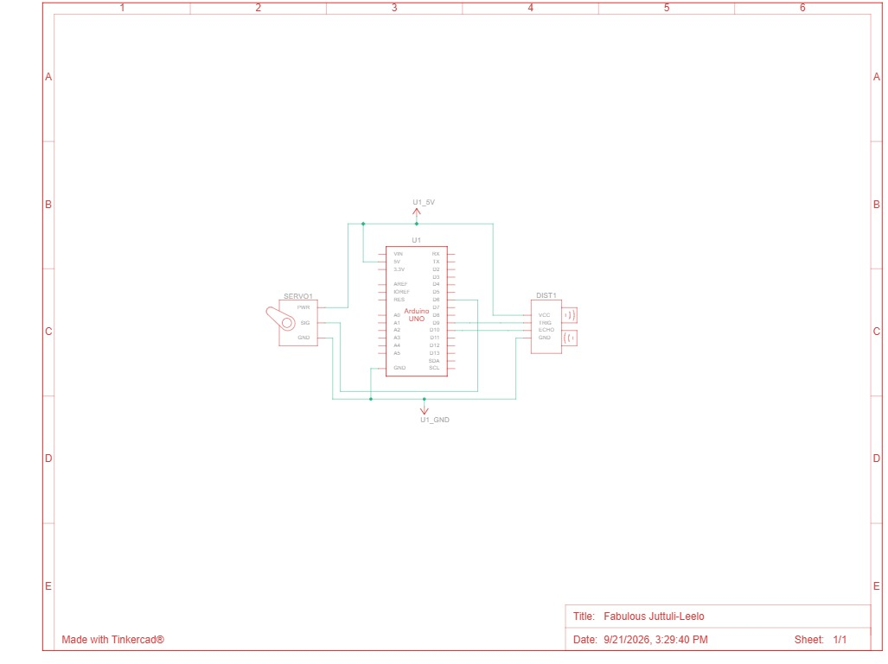

  
**RADAR GUARD USING ULTRASONIC SENSOR AND SERVO MOTOR**

1\. Aim  
               To design and develop a Radar Guard system using an Arduino, ultrasonic sensor and servo motor to detect objects and indicate their presence.

2\. Components Required.    
               •Arduino UNO  
               •Ultrasonic Sensor (HC-SR04)  
               •Servo Motor  
               •Buzzer  
               •Red LED  
               •Green LED  
               •LCD Display  
               •Resistors  
               •Breadboard  
               •Jumper wires  
               •USB/Power supply

3\. Principle  
               The project works based on the reflection of ultrasonic waves. The ultrasonic sensor sends sound waves and receives the reflected waves from an object. The Arduino calculates the distance based on the time taken by the waves to return.

4\. Working  
                 •The ultrasonic sensor is mounted on a servo motor so that it can rotate through different angles and scan the surrounding area. When an object comes within the set detection range, the sensor detects it and sends the information to the Arduino.  
                 •The Arduino processes the distance and angle information. When an object is detected, the buzzer and red LED indicate the presence of an object. The LCD can display the detection status and distance. The green LED indicates that no object is detected within the specified range.

5\. Procedure  
              1\. Connect the ultrasonic sensor to the Arduino.  
              2\. Connect the servo motor to the Arduino.  
              3\. Connect the LEDs, buzzer and LCD according to the circuit.  
              4\. Upload the Arduino program.  
              5\. Place the ultrasonic sensor on the servo motor.  
              6\. Power ON the circuit.  
              7\. The servo rotates the sensor and scans the surrounding area.  
             8\. When an object enters the detection range, the distance is measured.  
             9\. The detected object information is indicated using the LED, buzzer and LCD.

6\. Applications  
          •Security and surveillance systems  
          •Obstacle detection  
          •Smart parking systems  
         •Robot navigation  
         •Restricted-area monitoring  
         •Automatic object detection

7\. Result  
           The Radar Guard system using an ultrasonic sensor and servo motor was successfully constructed and tested. The system detects objects at different angles and indicates their presence based on the measured distance.  

##Result : 

